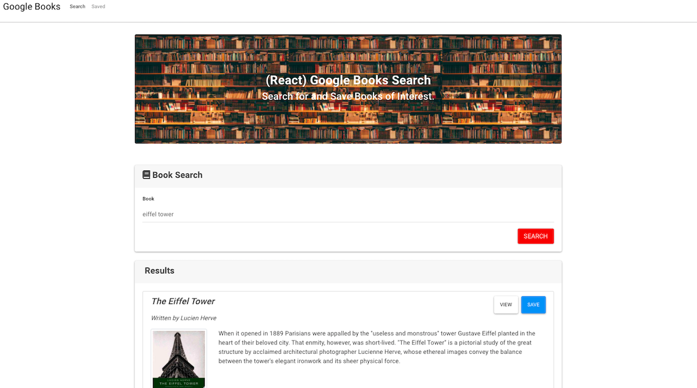

# MERN: GOOGLE BOOK SEARCH

## Description

Created a React-based Google Books Search app, by creating React components, work with helper/util functions, and utilize React lifecycle methods to query and display books based on user searches. Also used Node, Express and MongoDB so that users can save books to review or purchase later.

## Table of Contents

1. [Usage](#Usage)
2. [Github repository and Heroku deployed app link](#Github-repository-Heroku-deployed-link)
3. [App-screenshots](#App-screenshots)
4. [Questions](#Questions)

## Usage

- Click on the deployed app link and start searching for your favorite books!
- If you clone the repo to your local computer, you will have to connect to a database, you are able to do so by using mongoDB. You can then run `npm start` in your terminal to get the app satarted in your browser.

### Github-repository-Heroku-deployed-link

- Github repository:
  [Github repository](https://github.com/JessicaPerez1/Google-Book-Search.git)
- Heroku Deployed link:
  [Heroku deployed app link](https://gooogleboooks.herokuapp.com/)

### App-screenshots

### Questions

For any questions about this app or if you'd like to contribute, please refer to my Github page or contact me by email!

- [JessicaPerez1 Github link:](https://github.com/JessicaPerez1)
- 1jessicaperez@gmail.com
